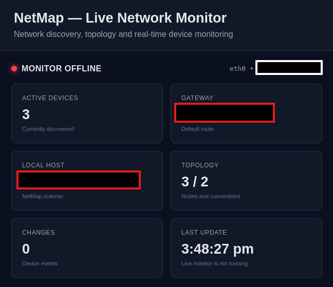
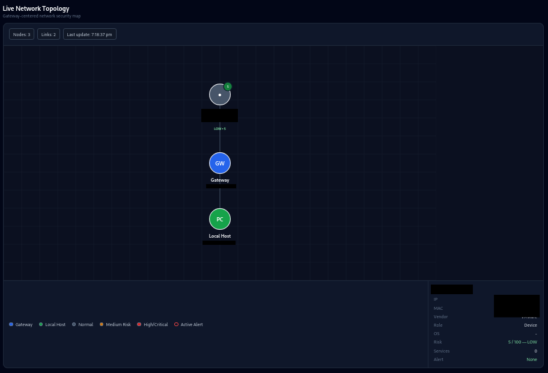
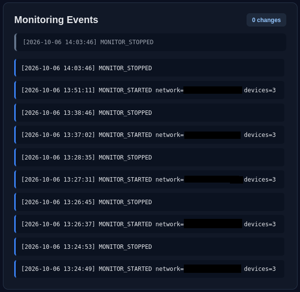
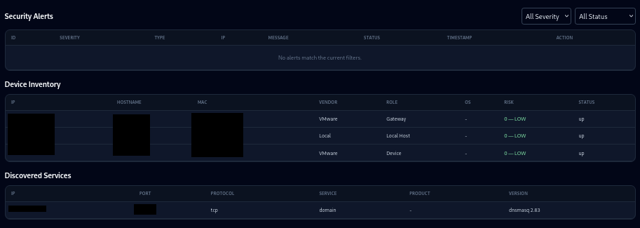

# NetMap

### Linux Network Discovery • Topology Mapping • Live Monitoring • Security Alerting

<p align="center">
  <strong>A practical Linux cybersecurity project for network visibility, continuous monitoring, topology mapping, and security alert generation.</strong>
</p>

<p align="center">


</p>

---

## 📌 Overview

**NetMap** is a Linux-based network discovery and security monitoring platform written in Python.

It discovers active devices on an authorized IPv4 network, identifies the default gateway and local host, builds a network topology, continuously monitors the environment for changes, and converts those changes into structured security alerts.

The project combines network discovery, topology visualization, live monitoring, event logging, alert generation, REST APIs, and a lightweight SOC-style dashboard.

### Core workflow

```text
Network Discovery
       ↓
Device Identification
       ↓
Gateway Detection
       ↓
Device Classification
       ↓
Topology Mapping
       ↓
Live Monitoring
       ↓
Change Detection
       ↓
Security Alerting
       ↓
SOC-Style Dashboard
```

NetMap was developed as a practical cybersecurity portfolio project demonstrating skills in:

* Linux
* Python
* Computer Networking
* Nmap
* Network Monitoring
* Security Alerting
* Flask
* REST APIs
* Automation
* Testing
* Security Operations concepts

> **⚠️ Authorized Use Only:** NetMap should only be used on networks and systems that you own or have explicit permission to monitor.

---

# 📸 Screenshots

## Live Security Dashboard

The NetMap dashboard provides a centralized view of network information, active devices, topology, monitoring status, security alerts, and events.

<p align="center">
  
</p>

---

## Network Topology

NetMap generates a visual representation of the discovered network, including the gateway, local host, and discovered devices.

<p align="center">
  
</p>

---

## Live Network Monitoring

The live monitoring engine repeatedly scans the network and compares the current state against the previous scan.

<p align="center">
  
</p>

---

## Network Discovery

NetMap uses Nmap to identify active hosts and collect available network information.

<p align="center">
  
</p>

---

# ✨ Features

| Feature                   | Description                                      |
| ------------------------- | ------------------------------------------------ |
| 🔎 Network Discovery      | Discovers active devices using Nmap              |
| 🖥️ Interface Detection   | Identifies the local IPv4 interface and network  |
| 🌐 Gateway Detection      | Detects the default IPv4 gateway                 |
| 🏷️ Device Classification | Classifies Gateway, Local Host, and Device       |
| 🗺️ Topology Mapping      | Builds a graph representation of the network     |
| 📡 Live Monitoring        | Continuously monitors network changes            |
| 🔄 Change Detection       | Detects new and removed devices                  |
| 🚨 Security Alerts        | Converts device changes into structured alerts   |
| 💓 Monitor Heartbeat      | Tracks the health of the live monitoring process |
| 📊 SOC Dashboard          | Provides a browser-based monitoring interface    |
| 🔌 REST API               | Exposes network information through Flask        |
| 📄 Reporting              | Generates JSON, CSV, and topology reports        |
| 🧪 Automated Testing      | pytest-based test suite                          |

---

# 🏗️ Architecture

```text
                         ┌─────────────────────┐
                         │      NetMap CLI     │
                         └──────────┬──────────┘
                                    │
                                    ▼
                         ┌─────────────────────┐
                         │ Interface Discovery │
                         │       psutil        │
                         └──────────┬──────────┘
                                    │
                                    ▼
                         ┌─────────────────────┐
                         │   Network Scanner   │
                         │        Nmap         │
                         └──────────┬──────────┘
                                    │
                                    ▼
                         ┌─────────────────────┐
                         │ Gateway Detection   │
                         │ Linux Routing Table │
                         └──────────┬──────────┘
                                    │
                                    ▼
                         ┌─────────────────────┐
                         │ Device Classifier   │
                         └──────────┬──────────┘
                                    │
                    ┌───────────────┴───────────────┐
                    ▼                               ▼
          ┌────────────────────┐          ┌────────────────────┐
          │  Topology Engine   │          │ Reporting Engine   │
          └─────────┬──────────┘          └─────────┬──────────┘
                    │                               │
                    ▼                               ▼
          ┌────────────────────┐          ┌────────────────────┐
          │ Interactive HTML   │          │ JSON / CSV Reports │
          └────────────────────┘          └────────────────────┘

                         Live Monitoring
                                │
                                ▼
                    ┌────────────────────┐
                    │ Device Comparison  │
                    └─────────┬──────────┘
                              │
                    ┌─────────┴─────────┐
                    ▼                   ▼
              New Device         Device Removed
                    │                   │
                    └─────────┬─────────┘
                              ▼
                    ┌────────────────────┐
                    │   Alert Engine     │
                    └─────────┬──────────┘
                              │
                              ▼
                    ┌────────────────────┐
                    │ Alert History JSON │
                    └─────────┬──────────┘
                              │
                              ▼
                    ┌────────────────────┐
                    │  Flask Dashboard   │
                    └────────────────────┘
```

---

# 📂 Project Structure

```text
NetMap/
│
├── netmap/
│   │
│   ├── __init__.py
│   │
│   ├── cli.py
│   │       └── Main network discovery CLI
│   │
│   ├── network.py
│   │       └── Linux interface and IPv4 discovery
│   │
│   ├── scanner.py
│   │       └── Nmap network/device discovery
│   │
│   ├── gateway.py
│   │       └── Default gateway detection
│   │
│   ├── classifier.py
│   │       └── Device role classification
│   │
│   ├── reporter.py
│   │       └── JSON / CSV / topology exports
│   │
│   ├── topology.py
│   │       └── Network topology engine
│   │
│   ├── topology_view.py
│   │       └── Standalone HTML topology visualization
│   │
│   ├── monitor.py
│   │       └── Device change detection
│   │
│   ├── live.py
│   │       └── Continuous monitoring and alert pipeline
│   │
│   ├── alerts.py
│   │       └── Structured security alert generation
│   │
│   ├── dashboard.py
│   │       └── Flask API and dashboard server
│   │
│   └── templates/
│       └── dashboard.html
│               └── NetMap web dashboard
│
├── tests/
│   ├── test_network.py
│   ├── test_scanner.py
│   ├── test_gateway.py
│   ├── test_classifier.py
│   ├── test_reporter.py
│   ├── test_topology.py
│   ├── test_topology_view.py
│   ├── test_monitor.py
│   └── test_alerts.py
│
├── reports/
│       └── Runtime-generated reports and monitoring data
│
├── screenshots/
│   ├── dashboard.png
│   ├── topology.png
│   ├── live-monitor.png
│   ├── security-alert.png
│   └── network-scan.png
│
├── requirements.txt
├── pytest.ini
├── .gitignore
├── CHANGELOG.md
├── LICENSE
└── README.md
```

---

# 🛠️ Technology Stack

### Core

* **Python 3.11+**
* **Linux**
* **Nmap**
* **psutil**

### Web Dashboard

* **Flask**
* **HTML5**
* **CSS3**
* **JavaScript**
* **SVG**

### Testing

* **pytest**

### Data & Reporting

* **JSON**
* **CSV**

---

# 💻 Installation

## Prerequisites

Before installing NetMap, make sure you have:

* Linux
* Python 3.11 or newer
* Nmap
* Git
* Python virtual environment support

---

## 1. Clone the repository

```bash
git clone https://github.com/YOUR_USERNAME/NetMap.git
```

Move into the project:

```bash
cd NetMap
```

---

## 2. Verify Python

```bash
python3 --version
```

Example:

```text
Python 3.11.x
```

---

## 3. Verify Nmap

```bash
nmap --version
```

If Nmap is not installed on Kali/Debian/Ubuntu:

```bash
sudo apt update
sudo apt install nmap
```

Verify:

```bash
nmap --version
```

---

## 4. Create a virtual environment

```bash
python3 -m venv .venv
```

Activate it:

```bash
source .venv/bin/activate
```

Your terminal should now show:

```text
(.venv)
```

---

## 5. Install dependencies

```bash
pip install -r requirements.txt
```

---

## 6. Verify the installation

Compile the Python modules:

```bash
python -m py_compile netmap/*.py
```

Run the test suite:

```bash
python -m pytest -v
```

A successful installation should show all tests passing.

---

# ▶️ Usage

## Network Discovery

Start NetMap:

```bash
python -m netmap.cli
```

The scanner performs the following workflow:

```text
1. Detect network interface
2. Determine local IPv4 address
3. Determine network CIDR
4. Detect default gateway
5. Discover active devices
6. Collect MAC/vendor information
7. Classify devices
8. Build topology
9. Generate reports
10. Generate topology HTML
```

---

# 📡 Live Network Monitoring

Start the continuous monitor:

```bash
python -m netmap.live
```

Default scan interval:

```text
10 seconds
```

Example:

```text
============================================================
                 NETMAP LIVE MONITOR
============================================================

Network : __.__.__.0/24
Interval: 10 seconds

[*] Starting initial scan...

[+] Initial devices discovered: 3

[*] Monitoring for changes...
[*] Press Ctrl+C to stop.
```

Stop the monitor:

```text
Ctrl+C
```

---

# 🚨 Security Alerting

NetMap compares consecutive scans to detect changes in the network.

### New device

When a previously unseen device appears:

```text
[!] SECURITY ALERT:
MEDIUM - New Network Device Detected
```

The alert contains:

```json
{
    "type": "NETWORK_DEVICE_CHANGE",
    "title": "New Network Device Detected",
    "severity": "MEDIUM",
    "message": "New device detected at __.__.__.__"
}
```

### Removed device

When a previously detected device disappears:

```json
{
    "type": "NETWORK_DEVICE_REMOVED",
    "title": "Network Device Removed",
    "severity": "LOW"
}
```

Alert history is stored locally and exposed through the dashboard API.

---

# 💓 Monitor Heartbeat

The live monitoring process periodically writes a heartbeat containing:

```text
Timestamp
Network
Active device count
Monitor status
```

The dashboard uses this heartbeat to determine the monitor state:

```text
MONITORING
MONITOR STALE
MONITOR OFFLINE
```

This helps distinguish between:

* A healthy monitoring process
* A monitor that has stopped updating
* A monitor that is no longer running

---

# 📊 Dashboard

Start the dashboard:

```bash
python -m netmap.dashboard
```

The Flask server runs on:

```text
http://127.0.0.1:5001
```

Open the address in your browser.

The dashboard provides:

* Active device count
* Gateway information
* Local host information
* Network information
* Network topology
* Security alerts
* Monitoring events
* Device inventory
* Monitor health
* Automatic refresh

---

# 🔌 REST API

NetMap exposes a lightweight REST API through Flask.

## Health Check

```http
GET /api/health
```

Example response:

```json
{
    "service": "NetMap Dashboard API",
    "status": "ok"
}
```

---

## Network Status

```http
GET /api/status
```

The endpoint provides:

```text
Network information
Device inventory
Topology
Monitoring events
Security alerts
Monitor health
```

Example structure:

```json
{
    "project": "NetMap",
    "network": {},
    "summary": {},
    "devices": [],
    "topology": {},
    "events": [],
    "alerts": [],
    "monitor": {}
}
```

---

# 📁 Generated Runtime Data

NetMap generates runtime information under the `reports/` directory.

```text
reports/
│
├── netmap_report.json
├── netmap_topology.json
├── netmap_topology.html
├── netmap_alerts.json
├── netmap_events.log
└── netmap_heartbeat.json
```

These files contain environment-specific runtime information and are intentionally excluded from Git using `.gitignore`.

---

# 📄 Reporting

NetMap supports multiple output formats.

### JSON

Network information and device inventory:

```text
reports/netmap_report.json
```

### CSV

Device inventory export:

```text
IP
Hostname
MAC
Vendor
Status
Role
```

### Topology JSON

```text
reports/netmap_topology.json
```

### Topology HTML

```text
reports/netmap_topology.html
```

### Security Alerts

```text
reports/netmap_alerts.json
```

### Monitoring Events

```text
reports/netmap_events.log
```

---

# 🧪 Testing

Run the complete test suite:

```bash
python -m pytest -v
```

Tests cover:

* Network interface discovery
* IPv4 network detection
* Nmap scanner parsing
* Gateway detection
* Device classification
* JSON reporting
* CSV reporting
* Topology generation
* Topology HTML generation
* Device addition detection
* Device removal detection
* Security alert generation
* Alert data validation

Current project baseline:

```text
24 automated tests
```

---

# 🔐 Security Design

NetMap follows a defensive network-monitoring model:

```text
              Asset Discovery
                     ↓
              Network Visibility
                     ↓
                  Baseline
                     ↓
            Continuous Monitoring
                     ↓
              Change Detection
                     ↓
               Alert Creation
                     ↓
                Investigation
```

A new device is **not automatically considered malicious**.

Instead, NetMap identifies the change and creates an alert that can be reviewed by an administrator or security analyst.

---

# 🎯 Cybersecurity Concepts Demonstrated

NetMap demonstrates practical concepts relevant to entry-level SOC, security analyst, and network security roles.

### Network Security

* Network reconnaissance
* Asset discovery
* Network inventory
* Gateway identification
* MAC address discovery
* Vendor identification
* Network topology

### Security Operations

* Continuous monitoring
* Baseline comparison
* Change detection
* Event logging
* Security alerting
* Alert severity
* Monitoring health

### Security Engineering

* Python automation
* REST API development
* Dashboard development
* Structured security data
* Modular architecture
* Automated testing

---

# 🧩 MITRE ATT&CK Context

NetMap's network visibility capabilities can support defensive investigation related to network discovery concepts.

| Technique                                          | Context                                |
| -------------------------------------------------- | -------------------------------------- |
| **T1046 — Network Service Scanning**               | Network and service discovery context  |
| **T1016 — System Network Configuration Discovery** | Local network configuration visibility |

These mappings describe security concepts relevant to the project.

NetMap does **not** claim comprehensive detection of these MITRE ATT&CK techniques.

---

# 🔄 Detection Workflow

```text
                    ┌──────────────┐
                    │ Network Scan │
                    └──────┬───────┘
                           │
                           ▼
                    ┌──────────────┐
                    │ Device List  │
                    └──────┬───────┘
                           │
                           ▼
                    ┌──────────────┐
                    │   Baseline   │
                    └──────┬───────┘
                           │
                           ▼
                    ┌──────────────┐
                    │  Next Scan   │
                    └──────┬───────┘
                           │
                           ▼
                    ┌──────────────┐
                    │   Compare    │
                    └──────┬───────┘
                           │
                  ┌────────┴────────┐
                  │                 │
                  ▼                 ▼
            New Device       Device Removed
                  │                 │
                  └────────┬────────┘
                           │
                           ▼
                    ┌──────────────┐
                    │ Alert Engine │
                    └──────┬───────┘
                           │
                           ▼
                    ┌──────────────┐
                    │ Alert History│
                    └──────┬───────┘
                           │
                           ▼
                    ┌──────────────┐
                    │  Dashboard   │
                    └──────────────┘
```

---

# 🧪 Example Environment

Example development environment:

```text
Operating System : Kali Linux
Interface        : eth0
Local IP         : __.__.__.__
Network          : __.__.__.__/24
Gateway          : __.__.__.__
Scanner          : Nmap
Dashboard        : Flask
Testing          : pytest
```

Example discovered devices:

```text
__.__.__.__
    └── Gateway

__.__.__.__
    └── Local Host

__.__.__.__
    └── Device
```

---

# 🗺️ Example Network Topology

```text
                       ┌──────────────────┐
                       │     Gateway      │
                       │ __.__.__.__   │
                       └────────┬─────────┘
                                │
                  ┌─────────────┼─────────────┐
                  │             │             │
                  ▼             ▼             ▼
          ┌────────────┐ ┌────────────┐ ┌────────────┐
          │ Local Host │ │   Device   │ │   Device   │
          │__.__.__ │ │__.__.__ │ │__.__.__ │
          │   .__     │ │   .____     │ │   .xxx     │
          └────────────┘ └────────────┘ └────────────┘
```

---

# 🧭 Development Roadmap

## v1.0.0 — Current Release

* [x] Network interface discovery
* [x] IPv4 network detection
* [x] Nmap device discovery
* [x] Hostname detection
* [x] MAC/vendor detection
* [x] Gateway detection
* [x] Device classification
* [x] JSON reporting
* [x] CSV reporting
* [x] Topology engine
* [x] Interactive topology
* [x] Live monitoring
* [x] Device change detection
* [x] Security alert engine
* [x] Alert history
* [x] Monitor heartbeat
* [x] Flask REST API
* [x] SOC-style dashboard
* [x] Automated testing
* [x] Project documentation

## Future Releases

* [ ] Advanced device fingerprinting
* [ ] Port and service discovery
* [ ] Operating system detection
* [ ] Historical device database
* [ ] Advanced anomaly detection
* [ ] Network risk scoring
* [ ] Alert acknowledgement
* [ ] Alert filtering
* [ ] Severity-based filtering
* [ ] Historical topology
* [ ] Dashboard analytics
* [ ] Security report generation
* [ ] Docker deployment
* [ ] CI/CD integration
* [ ] Dashboard authentication

---

# ⚠️ Responsible Use

NetMap is intended for:

* Personal networks
* Authorized enterprise networks
* Cybersecurity laboratories
* Educational environments
* Authorized penetration testing
* Defensive network monitoring

Do **not** scan networks or systems without authorization.

The author is not responsible for unauthorized use of this software.

---

# 🤝 Contributing

Contributions, suggestions, and improvements are welcome.

A typical contribution workflow:

```bash
git clone https://github.com/YOUR_USERNAME/NetMap.git
cd NetMap

git checkout -b feature/your-feature

# Make your changes

python -m pytest -v

git add .
git commit -m "Add your feature"

git push origin feature/your-feature
```

Then open a pull request.

---

# 👨‍💻 Author

## Ch Viswa

Cybersecurity-focused Computer Science graduate interested in:

* Security Operations
* Network Security
* Threat Detection
* Vulnerability Assessment
* Penetration Testing
* Linux Security
* Security Automation

---

# 📜 License

NetMap is released under the **MIT License**.

See [`LICENSE`](LICENSE) for the complete license text.

---

# 📋 Changelog

See [`CHANGELOG.md`](CHANGELOG.md) for the project release history.

---

# ⭐ Project Status

**Version:** `1.0.0`

**Status:** Portfolio Release

NetMap is a practical Linux cybersecurity project demonstrating:

```text
Network Discovery
       +
Topology Mapping
       +
Continuous Monitoring
       +
Change Detection
       +
Security Alerting
       +
REST API
       +
SOC Dashboard
       +
Automated Testing
```

If you find the project useful, consider giving it a ⭐ on GitHub.

---

<p align="center">
  <strong>NetMap — Turning network visibility into actionable security monitoring.</strong>
</p>
